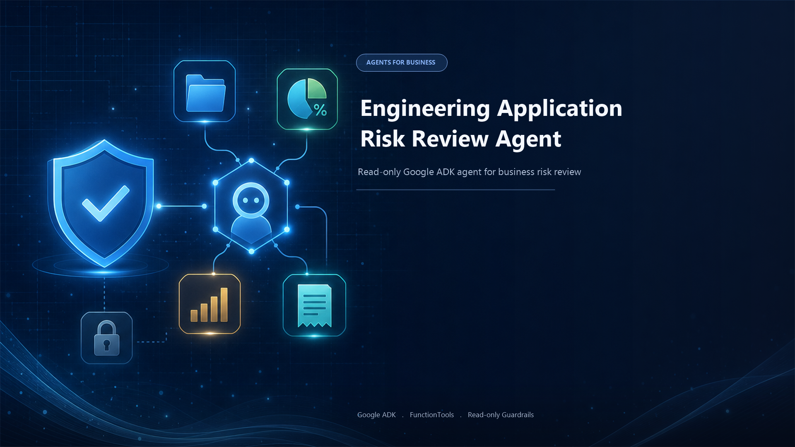
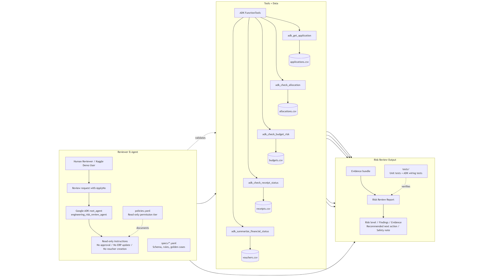
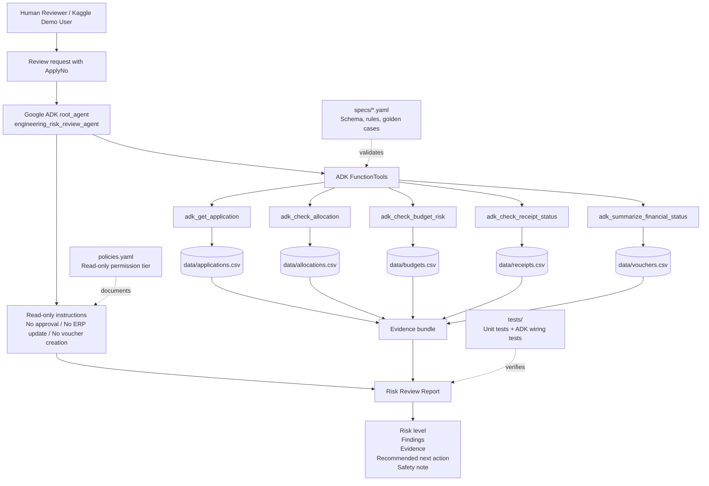

# Engineering Application Risk Review Agent



A read-only Google ADK agent demo for reviewing synthetic engineering application risk before human approval.

This project was built for the Kaggle / Google AI Agents capstone. It demonstrates how an agent can combine evidence from multiple business records, apply safety guardrails, and produce an explainable risk review without modifying source data.

**Demo video:** https://www.youtube.com/watch?v=KePgFrVUFw0

**GitHub:** https://github.com/mikenick456/engineering-risk-review-agent

## Problem

Engineering application review often requires checking several scattered records before an application can move forward:

- application header data
- allocation share rates
- budget limits and used amounts
- receipt due dates and penalty status
- voucher/payment state

Manual review is slow and error-prone. Common risks include allocation totals not equal to 100%, overdue receipts, budget overrun signals, or missing application records.

## Solution

The Engineering Application Risk Review Agent is a read-only assistant. Given an `ApplyNo`, it checks synthetic CSV data, combines evidence, and returns:

- risk level: `low`, `medium`, or `high`
- blocking status
- findings
- evidence
- recommended next action
- safety note

The agent does not approve applications, update ERP data, create vouchers, delete records, or connect to production databases.

## Current Status

Implemented:

- Local CLI demo
- Google ADK `root_agent`
- ADK `FunctionTool` wrappers around read-only review functions
- Synthetic CSV data
- Read-only safety policy
- Golden cases and unit tests
- Kaggle writeup draft in `WRITEUP.md`

Not implemented yet:

- MCP server
- Cloud Run / Agent Runtime deployment
- Public hosted demo endpoint
- Runtime policy server beyond declarative `policies.yaml` and ADK instructions

## Architecture



The system uses a Google ADK `root_agent` with read-only `FunctionTool` wrappers. The tools read synthetic CSV data, produce an evidence bundle, and return a structured risk review with findings, evidence, recommended next action, and a safety note.

<details>
<summary>Mermaid source</summary>



</details>

```text
User
  |
  v
Google ADK root_agent
  |
  v
ADK FunctionTools
  |-- adk_get_application
  |-- adk_check_allocation
  |-- adk_check_budget_risk
  |-- adk_check_receipt_status
  |-- adk_summarize_financial_status
  |
  v
Synthetic CSV data in data/
  |
  v
Risk review with findings, evidence, next action, and safety note
```

## Project Structure

```text
eg-risk-agent/
├── .agents/
│   └── skills/
│       └── engineering-risk-review/
│           └── SKILL.md      # Agentic coding tool / Antigravity-compatible skill copy
├── app/
│   ├── __init__.py          # Exposes ADK root_agent for `adk run app`
│   ├── adk_agent.py         # Google ADK agent and FunctionTool wrappers
│   ├── agent.py             # Local CLI demo entry point
│   ├── rules.py             # Deterministic risk rules
│   └── tools.py             # Read-only CSV access and risk checks
├── data/
│   ├── applications.csv
│   ├── allocations.csv
│   ├── budgets.csv
│   ├── receipts.csv
│   └── vouchers.csv
├── eval/
│   └── judge_rubric.yaml
├── specs/
│   ├── demo-script.md
│   ├── golden-cases.yaml
│   ├── project.md
│   ├── risk-rules.yaml
│   └── schema.yaml
├── skills/
│   └── engineering-risk-review/
│       └── SKILL.md          # Public project artifact for GitHub / Kaggle review
├── tests/
│   ├── test_adk_agent.py
│   └── test_agent.py
├── policies.yaml
├── requirements.txt
├── README.md
└── WRITEUP.md
```

## Requirements

- Python 3.11+
- Google ADK (`google-adk`)
- Gemini API key for ADK runtime testing

Install dependencies:

```powershell
cd C:\Kaggle2026課程\eg-risk-agent
py -m pip install -r requirements.txt
```

## Run the Local CLI Demo

The CLI demo does not require a Gemini API key. It runs deterministic local checks against synthetic CSV data.

```powershell
cd C:\Kaggle2026課程\eg-risk-agent
py app/agent.py EG-2026-0001
```

Expected result: low risk.

```powershell
py app/agent.py EG-2026-0002
```

Expected result: high risk with `allocation_total_not_100` and `overdue_receipt` findings.

## Run the ADK Agent

Set your Gemini API key in PowerShell. Do not commit API keys to code or documentation.

```powershell
cd C:\Kaggle2026課程\eg-risk-agent
$env:GOOGLE_GENAI_USE_VERTEXAI="FALSE"
$env:GOOGLE_API_KEY="YOUR_GEMINI_API_KEY"
& "$env:LOCALAPPDATA\Python\pythoncore-3.14-64\Scripts\adk.exe" run app "Review EG-2026-0001" --in_memory
```

The ADK CLI loads `app.root_agent`, which is exported from `app/__init__.py`.

If `adk.exe` is on your PATH, this shorter command also works:

```powershell
adk run app "Review EG-2026-0001" --in_memory
```

## Optional: Run ADK Web UI

```powershell
cd C:\Kaggle2026課程\eg-risk-agent
$env:GOOGLE_GENAI_USE_VERTEXAI="FALSE"
$env:GOOGLE_API_KEY="YOUR_GEMINI_API_KEY"
& "$env:LOCALAPPDATA\Python\pythoncore-3.14-64\Scripts\adk.exe" web .
```

Open the local URL printed by ADK.

## Run Tests

```powershell
cd C:\Kaggle2026課程\eg-risk-agent
py -m unittest discover -s tests -v
```

The tests verify:

- normal low-risk application behavior
- high-risk application behavior
- unknown application behavior
- ADK `root_agent` tool wiring
- ADK-safe tool wrappers that avoid `None` values in runtime tool responses

## ADK Agent Details

`app/adk_agent.py` defines:

- `root_agent`: Google ADK agent named `engineering_risk_review_agent`
- model: `gemini-2.5-flash`
- read-only instructions
- ADK `FunctionTool` wrappers:
  - `adk_get_application`
  - `adk_check_allocation`
  - `adk_check_budget_risk`
  - `adk_check_receipt_status`
  - `adk_summarize_financial_status`

The ADK wrappers return dictionary responses and sanitize `None` values so tool outputs are safer for ADK runtime serialization.

## Runtime Entrypoints and Skill Relationship

This project intentionally has two runtime entrypoints:

- `app/agent.py` is the local deterministic CLI demo. It is useful for testing the review logic without a Gemini API key.
- `app/adk_agent.py` is the Google ADK runtime entrypoint. It exposes the same review logic through ADK `FunctionTool` wrappers.

Both entrypoints share the same core implementation in `app/tools.py`, `app/rules.py`, and `data/*.csv`.

The Agent Skill is included in two locations:

- `skills/engineering-risk-review/SKILL.md` is the public project artifact for GitHub and Kaggle review.
- `.agents/skills/engineering-risk-review/SKILL.md` is the agentic-coding-tool copy for tools such as Antigravity-style project skills.

The skill documents the review workflow, output format, and read-only safety boundary. It is not a Python runtime dependency. The ADK agent does not automatically load `SKILL.md`; instead, `app/adk_agent.py` implements the same workflow through read-only instructions and ADK `FunctionTool` wrappers.

## Safety Design

All data is synthetic. This repository does not include real ERP data, real employee data, production credentials, API keys, passwords, or production database connections.

Safety controls:

- `policies.yaml` declares read-only permission tier.
- `policies.yaml` forbids approving applications, updating ERP data, creating vouchers, deleting records, and connecting to production databases.
- ADK agent instructions repeat the same restrictions.
- CLI output includes a safety note: `Read-only review only; no ERP records are modified.`

## Key Concepts Demonstrated

This project demonstrates these Kaggle capstone concepts:

1. **Agent / ADK**
   - `app/adk_agent.py` defines a Google ADK `root_agent`.
   - Existing review functions are exposed through ADK `FunctionTool`s.

2. **Security features**
   - `policies.yaml` and ADK instructions enforce a read-only review boundary.

3. **Agent skill**
   - The project includes `skills/engineering-risk-review/SKILL.md` for public review.
   - The project also includes `.agents/skills/engineering-risk-review/SKILL.md` for agentic coding tools such as Antigravity-style project skills.

4. **Evaluation / golden cases**
   - `specs/golden-cases.yaml` and `tests/` verify expected low-risk, high-risk, and not-found behavior.

5. **Spec-driven development**
   - `specs/` documents the problem, schema, rules, golden cases, and demo script.

## Demo Prompts

Use these with the CLI or ADK runtime:

- `Review EG-2026-0001`
- `Can EG-2026-0002 proceed?`
- `What evidence makes EG-2026-0002 high risk?`
- `Review EG-2099-9999`

## Troubleshooting

### `can't open file 'C:\Kaggle2026課程\app\agent.py'`

You are running from the parent folder. Change into the project folder first:

```powershell
cd C:\Kaggle2026課程\eg-risk-agent
py app/agent.py EG-2026-0001
```

Or run with the project-relative path:

```powershell
py eg-risk-agent/app/agent.py EG-2026-0001
```

### `No API key was provided`

Set the key in the current PowerShell session:

```powershell
$env:GOOGLE_API_KEY="YOUR_GEMINI_API_KEY"
```

### `429 RESOURCE_EXHAUSTED`

Your API key or Google AI Studio project has no available quota for the selected Gemini model. Check your quota in Google AI Studio or try again later.

### `503 UNAVAILABLE`

The Gemini model is temporarily under high demand. Wait and retry.

## Kaggle Submission Notes

For final Kaggle submission, this repository still needs external submission assets:

- public GitHub repository: https://github.com/mikenick456/engineering-risk-review-agent
- Kaggle Writeup submission based on `WRITEUP.md`
- public YouTube demo video: https://www.youtube.com/watch?v=KePgFrVUFw0
- Media Gallery cover image
- selected track: recommended **Agents for Business**

Do not include API keys, passwords, real company data, or production credentials in the public submission.

## License

No license has been selected yet. Add a license before publishing if you want others to reuse the code.
